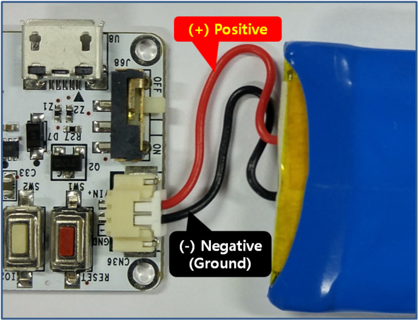
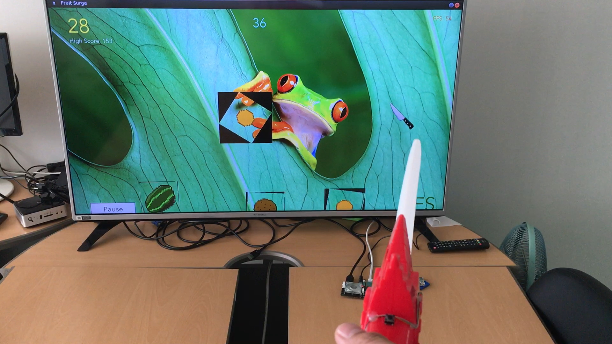

# Biscuit™ - Programmable Wi-Fi 9-Axis Absolute Orientation Sensor
The Biscuit™ is an integrated module consisting of 3 dimensional motion sensor and Wi-Fi communication module.  
The 3 dimensional motion sensor includes Accelerometer, Gyroscope and Geomagnetic sensor.   
The Biscuit™ provides 3-axis absolute orientation in the format of Quaternion, Euler Angle or Rotation Vector as well as Linear Acceleration, Gravity, Heading and Temperature.  
The Wi-Fi module has an inherent micro controller unit (MCU) on which users can download their own programs developed on separate development environment (IDE).  
The Biscuit™ can be operated using USB bus power or battery to be used as an independent device untethered to a host. 

## Specifications
### Sensor Data
* 3-Axis Gyroscope
* 3-Axis Accelerometer
* 3-Axis Geomagnetic Sensor
* 3-Axis Orientation: Quaternion, Euler Angle, Rotation Vector
* Linear Acceleration
* Gravity
* Heading
* Temperature

### Sensor Performance
* Accelerometer Ranges: ±2g, ±4g, ±8g, ±16g selectable
* Accelerometer Resolution: 14 bit
* Gyroscope Ranges: ±125°/s, ±250°/s, ±500°/s, ±1000°/s, ±2000°/s selectable
* Gyroscope Resolution: 16 bit
* Geomagnetic Sensor Ranges: ±1300µT (x, y axis), ±2500µT (z axis)
* Geomagnetic Sensor Resolution: 13 / 13 / 15 bits for x / y / z axes

### Wi-Fi
* Protocol: 802.11 b/g/n
* Frequency: 2.4 GHz band

### MCU
* CPU: 32-bit, 80 MHz
* Flash Memory: 2 MB

### IDE
* Arduino IDE

### Size
* 25 mm x 48 mm (PCB)

### Power
* USB Bus or Battery Operated
* Consumption: 75 mA (sensors and Wi-Fi turned-off)
* Input Voltage: 3.7 ~ 5.0 V

### Board Layout

### Exterior

## Warning!!
Incorrect battery connection can damage the Biscuit™. 
If your battery has different outputs from the one shown on the above picture, please use the accompanied cable to switch the polarity.
* Compatible Battery Connector: Molex 51021-0200

## WiFi Mouse using Biscuit™

## Tutorials and References
* Arduino IDE installation and board configuration: (https://youtu.be/6LCguMKGgyY)
* How to install the driver for Biscuit™ on Windows 7: (https://youtu.be/whfFNCH7KTk)
* Library installation using the Library Manager: (https://youtu.be/Scuj9SRVPwY) 
* Manual installation of libraries: (https://youtu.be/OV9ARozB2uk)
* Description of the 9-axis absolute orientation sensor - BNO055: (https://www.bosch-sensortec.com/bst/products/all_products/bno055)
* Document of the Wi-Fi module - ESP-WROOM-02: (https://espressif.com/en/support/download/documents)

