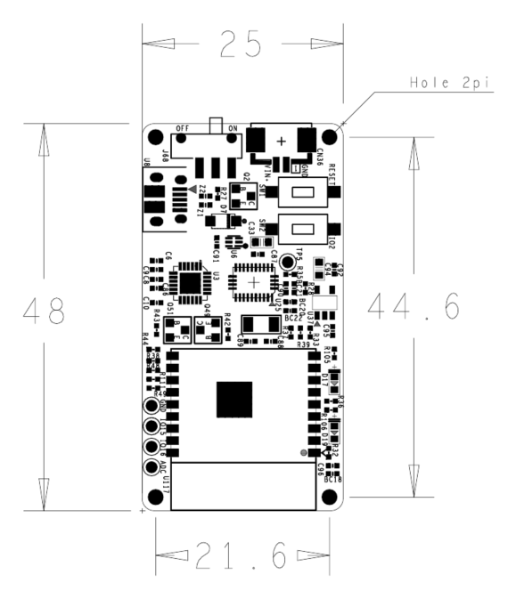
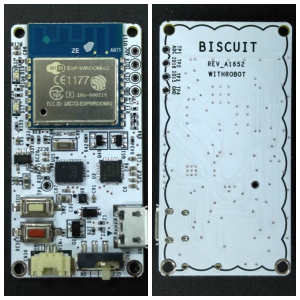
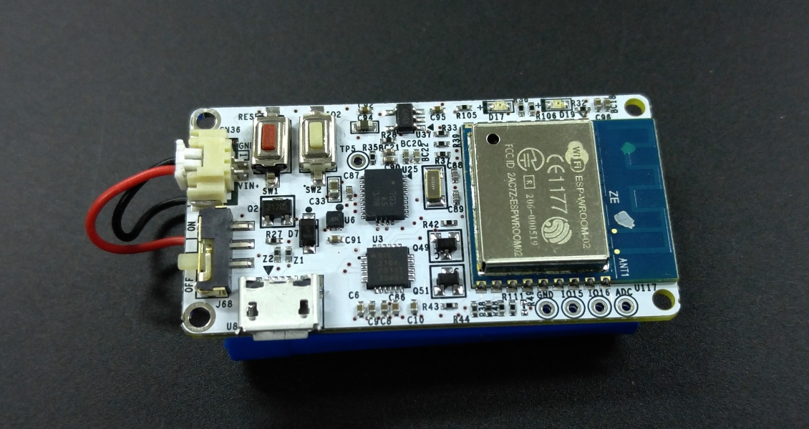
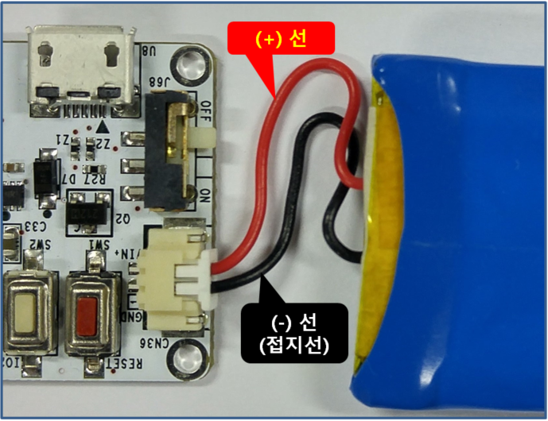

# Biscuit™ - Programmable Wi-Fi 9-Axis Absolute Orientation Sensor - [(English)](Product(English)/README.md)
Biscuit™은 가속도 센서, 자이로 센서, 지자기 센서 등의 9축 센서 및 Wi-Fi 모듈이 결합된 제품입니다. 센서들로부터 센서 데이터 자체(Raw Sensor Data) 및 3차원 공간에서의 방향 데이터(Orientation in Space)가 제공될 수 있으며, Wi-Fi 모듈에는 MCU가 내장되어 있어 사용자가 작성한 다양한 프로그램을 저장하여 실행시킬 수 있고, 충전 가능한 배터리를 연결하여 독립적으로 동작하는 모듈로 사용할 수 있습니다.

## 특징
### 센서 데이터
* 3축 직선 가속도(Linear Acceleration)
* 3축 각속도(Angular Rate)
* 3축 방향: 쿼터니언(Quaternion) 또는 오일러 방향(Euler Angle) 선택 가능
* 방위각(Heading)
* 온도

### 센서 성능
* 가속도 센서 측정 범위: ±2g, ±4g, ±8g, ±16g 선택 가능
* 가속도 센서 해상도: 14 bit
* 자이로스코프 센서 측정 범위: ±125°/s, ±250°/s, ±500°/s, ±1000°/s, ±2000°/s 선택 가능
* 자이로스코프 센서 해상도: 16 bit
* 지자기 센서 측정 범위: ±1300µT (x, y 축), ±2500µT (z 축)
* 지자기 센서 해상도: x / y / z 축에 대해 13 / 13 / 15 bit

### Wi-Fi 통신
* 프로토콜: 802.11 b/g/n

### 내장 MCU
* CPU: 32-bit, 80 MHz
* Flash Memory: 2 MB

### 지원 IDE
* Arduino IDE

### 전원
* 소모 전력: 75mA(센서 및 Wi-Fi 비사용시)
* 입력 전압: 3.7 ~ 5.0 V

### 무게
* 5 g (배터리 제외)

## 외형

### 보드 Layout

### 외부

## 주의 사항
배터리의 극성을 잘못 연결하면 Biscuit™이 손상될 수 있습니다. 
사용하려는 배터리의 극성이 위의 사진과 다른 경우에는 동봉된 교차 연결용 케이블을 사용하여 맞게 연결해 주십시오.
* 호환 배터리 커넥터: Molex 51021-0200

## 관련 자료
* 사용법 동영상 1: Arduino IDE 설치와 보드 설정: (https://youtu.be/6LCguMKGgyY)
* 사용법 동영상 1-1: Windows 7에서 Biscuit™ 디바이스 드라이버 설치하기: (https://youtu.be/whfFNCH7KTk)
* 사용법 동영상 2-A: Library Manager를 이용하여 라이브러리 설치하기: (https://youtu.be/Scuj9SRVPwY)
* 사용법 동영상 2-B: 라이브러리 직접 설치하기: (https://youtu.be/OV9ARozB2uk)
* 9축 센서(BNO055) 자료: https://www.bosch-sensortec.com/bst/products/all_products/bno055
* Wi-Fi 모듈(ESP-WROOM-02) 자료: https://espressif.com/en/support/download/documents

